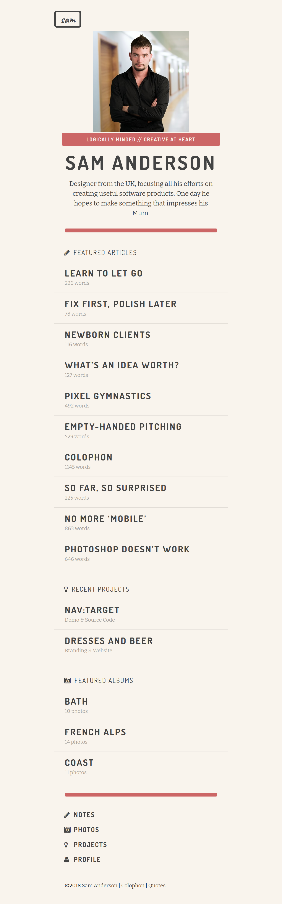

# Style a Professional Portfolio 

## Context 
Sam Anderson has been working as a Graphic Designer in London for several years. He now plans to expand his work in and outside London by having a web presence that showcases his work. Sam has already designed the layout of his web page but needs help in scripting the markups and styles to realize the design.​

Sam had assigned this work to a local FrontEnd Developer, but the developer had some challenges and unfortunately could only produce the markup. Sam now needs help in styling the web page such that it gives a great user-experience to attract his customers.​

As a web developer, you need to apply style to the web page provided to make it look more attractive and appealing to his customers.

## Problem Statement
Utilize CSS3 style properties to style a user-friendly web page that displays a professional portfolio. 

**Style the Portfolio page to resemble the image given below.**


### Details
- There are 4 fonts which are widely used across the page and they can be found at following locations:
    - FontAwesome -  https://cdnjs.cloudflare.com/ajax/libs/font-awesome/6.1.1/css/all.min.css (fa-solid, fa-pencil, fa-user, fa-lightbulb, fa-camera-retro)
    - Caveat - https://fonts.google.com/specimen/Caveat
    - Dosis - https://fonts.google.com/specimen/Dosis
    - Bitter - https://fonts.google.com/specimen/Bitter
- Color Codes frequently used on the page
    - Light Gray - rgba(0,0,0,0.1)
    - Dark Gray - rgba(0,0,0,0.35)
    - [#c66](./c66.png)
    - [#F9F4ED](./f9f4ed.png) 
    - [#444](./444.png)
- Images used across the page
    - [Sam](./sam.png)

### Tasks

- The boilerplate for this challenge contains `index.html` with HTML5 tags​
- As part of solution, the HTML elements should be styled using CSS3 style properties.​
- The solution for this practice can be developed in 4 steps:​​​​
    - Step 1: Define styles in`style.css` file located in `css` folder of the boilerplate​​​​.
    - Step 2: Link the styles.css file with index.html​​ using `<link>` tag​​.
    - Step 3: Link the predefined stylesheets for fonts in `index.html` file​.
    - Step 4: Apply styles defined using class or id selector to the page elements​.

- CSS Properties like color, background-color, display, list-style, font, margin, padding, border, width, line-height, letter-spacing, text related properties should be used to achieve the expected output. 

- Below is the list of predefined stylesheets that need to be added inside the `index.html` for formatting fonts.
    ```
    <link href="https://cdnjs.cloudflare.com/ajax/libs/font-awesome/6.1.1/css/all.min.css" integrity="sha512-KfkfwYDsLkIlwQp6LFnl8zNdLGxu9YAA1QvwINks4PhcElQSvqcyVLLD9aMhXd13uQjoXtEKNosOWaZqXgel0g==" crossorigin="anonymous" referrerpolicy="no-referrer">​
    <link rel="preconnect" href="https://fonts.gstatic.com">​
    <link href="https://fonts.googleapis.com/css2?family=Caveat:wght@700&display=swap" rel="stylesheet">​
    <link rel="stylesheet" href="https://fonts.googleapis.com/css?family=Dosis:400,700%7CBitter:400,400italic,700&subset=latin,latin">​
    
    ```
​
